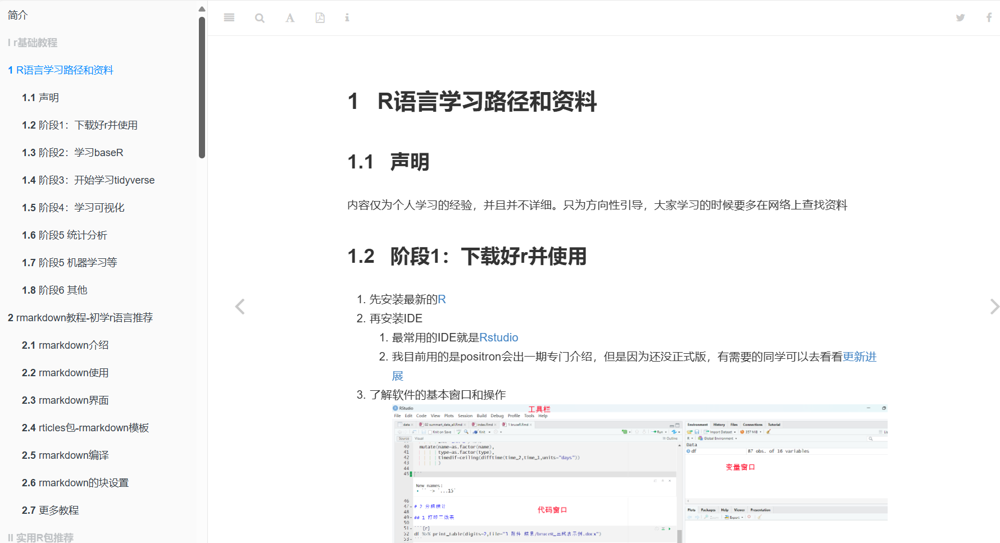

# 科研学帮帮-r语言教程库

## 文档链接

[文档链接](https://rtuto.wk8686.top/)

[博客链接](https://wk8686.top/)

## 教程说明

整个教程开始写于2024年10月10日，抽时间一点点写

本教程基于R语言，使用RStudio进行开发，使用bookdown排版

## 教程大纲

- [R基础教程](https://rtuto.wk8686.top/r%E8%AF%AD%E8%A8%80%E5%AD%A6%E4%B9%A0%E8%B7%AF%E5%BE%84%E5%92%8C%E8%B5%84%E6%96%99.html)
- [实用R包推荐](https://rtuto.wk8686.top/brucer-r%E5%8C%85%E9%87%8C%E7%9A%84%E7%91%9E%E5%A3%AB%E5%86%9B%E5%88%80.html)
- [R可视化教程](https://rtuto.wk8686.top/r%E8%AF%AD%E8%A8%80%E9%85%8D%E8%89%B2%E6%95%99%E7%A8%8B.html)
- [R实用操作合集](https://rtuto.wk8686.top/r%E8%AF%AD%E8%A8%80%E6%89%B9%E9%87%8F%E5%AF%BC%E5%85%A5%E6%95%B0%E6%8D%AE.html)

## 教程截图

