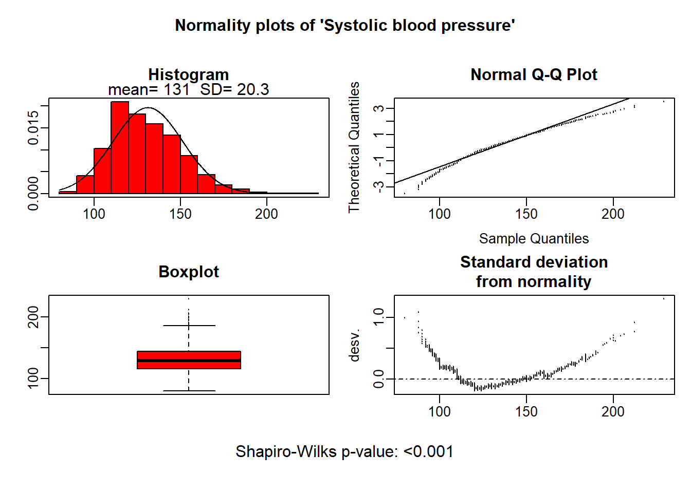
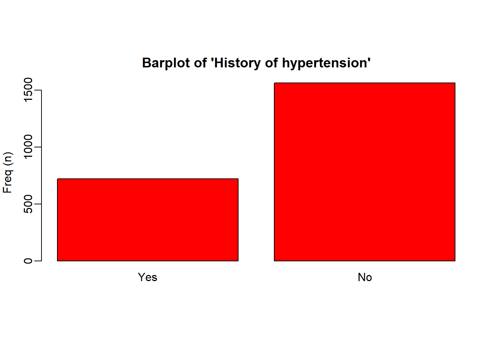
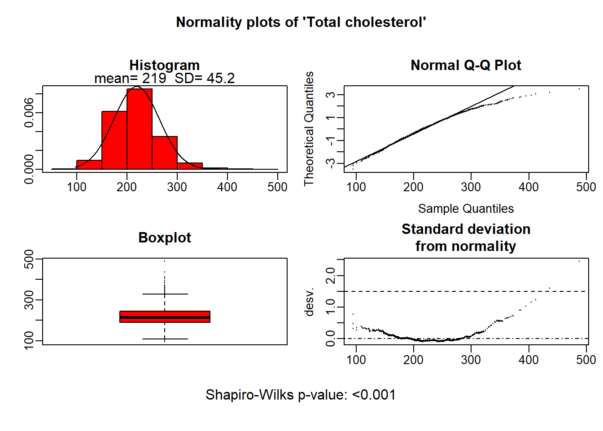

# 第95期 R语言教程！compareGroups神包制作描述性表一 {#compare}


> 第95期 R语言教程！compareGroups神包制作描述性表一
>
> 描述性表1在论文写作中占据着开篇起笔的作用。**对所用的数据进行描述和简单分析，为后续的模型构建提供数据可靠性信息**
>
> 本期介绍如何使用compareGroups神包来快速生成符合学术规范的表1。并进行包括以下自定义设置：1**.设置亚组 2.设置非正态变量使用非参组间检验 3.设置显示缺失值 4.设置显示OR值 5.设置使用自定义组间比较方法 6 数据导出**

## R包介绍

compareGroups 是一个在 CRAN 上可用的 R 包，**它可以生成描述性表格，展示几个变量的均值、标准差、分位数或频率。此外，还会使用适当的测试计算 p 值来检验组间差异。**

通过简单的代码，就能在 R 中生成美观、规范且可直接用于论文发表的描述性表格。这些表格还可以**导出到不同的格式，如 Word、Excel、PDF，或插入到 R-Sweave 或 R-markdown 文档中**。

在[手册](https://cran.r-project.org/web/packages/compareGroups/vignettes/compareGroups_vignette.html) <https://cran.r-project.org/web/packages/compareGroups/vignettes/compareGroups_vignette.html>里提供了非常友好的R包教程，描述了 compareGroups 的所有功能，并附有实际示例。\

## R包安装

从CRAN中安装R包


``` r
install.packages("compareGroups") 
```

或者从github安装最新版本


``` r
library(devtools) 
devtools::install_github("isubirana/compareGroups")
```

## R包参数

### **查看数据**

(不重要可以不看，知道是**包含多种数据类型的数据集即可**)调用R包自带的regicor数据，包含25个变量。regicor（吉罗纳心脏登记）研究是一项横断面研究，参与者来自西班牙东北部地区。在此研究中，收集了参与者的各种数据集，包括人口统计信息（如年龄和性别）、人体测量数据（如身高、体重和腰围）以及脂质水平（包括总胆固醇和甘油三酯）。此外，参与者还完成了涵盖体育活动和生活质量等领域的问卷。

为了追踪健康结果，研究还收集了关于心血管事件和死亡的数据。这些信息是通过医院和官方登记册及报告，在超过10年的时间里获得的。


``` r
library(compareGroups)
library(bruceR) #之前有介绍过，方便描述数据
```


``` r
# 方便起见，我们只分析前十个变量
data("regicor")

regicor <- regicor[,1:10]

str(regicor)
```

```
## 'data.frame':	2294 obs. of  10 variables:
##  $ id     : num  2.26e+03 1.88e+03 3.00e+09 3.00e+09 3.00e+09 ...
##   ..- attr(*, "label")= Named chr "Individual id"
##   .. ..- attr(*, "names")= chr "id"
##  $ year   : Factor w/ 3 levels "1995","2000",..: 3 3 2 2 2 2 2 1 3 1 ...
##   ..- attr(*, "label")= Named chr "Recruitment year"
##   .. ..- attr(*, "names")= chr "year"
##  $ age    : int  70 56 37 69 70 40 66 53 43 70 ...
##   ..- attr(*, "label")= Named chr "Age"
##   .. ..- attr(*, "names")= chr "age"
##  $ sex    : Factor w/ 2 levels "Male","Female": 2 2 1 2 2 2 1 2 2 1 ...
##   ..- attr(*, "label")= chr "Sex"
##  $ smoker : Factor w/ 3 levels "Never smoker",..: 1 1 2 1 NA 2 1 1 3 3 ...
##   ..- attr(*, "label")= Named chr "Smoking status"
##   .. ..- attr(*, "names")= chr "smoker"
##  $ sbp    : int  138 139 132 168 NA 108 120 132 95 142 ...
##   ..- attr(*, "label")= Named chr "Systolic blood pressure"
##   .. ..- attr(*, "names")= chr "sbp"
##  $ dbp    : int  75 89 82 97 NA 70 72 78 65 78 ...
##   ..- attr(*, "label")= Named chr "Diastolic blood pressure"
##   .. ..- attr(*, "names")= chr "dbp"
##  $ histhtn: Factor w/ 2 levels "Yes","No": 2 2 2 2 2 2 1 2 2 2 ...
##   ..- attr(*, "label")= Named chr "History of hypertension"
##   .. ..- attr(*, "names")= chr "histbp"
##  $ txhtn  : Factor w/ 2 levels "No","Yes": 1 1 1 1 1 1 2 1 1 1 ...
##   ..- attr(*, "label")= chr "Hypertension treatment"
##  $ chol   : num  294 220 245 168 NA NA 298 254 194 188 ...
##   ..- attr(*, "label")= Named chr "Total cholesterol"
##   .. ..- attr(*, "names")= chr "chol"
```

### **生成描述性统计表**

简单生成一个最简单的描述性统计表，发现定量资料用平均值标准差描述，分类资料用例数和占比描述


``` r
descrTable( ~ ., data = regicor)
```

```
## 
## --------Summary descriptives table ---------
## 
## _______________________________________________________ 
##                                     [ALL]           N   
##                                    N=2294               
## ¯¯¯¯¯¯¯¯¯¯¯¯¯¯¯¯¯¯¯¯¯¯¯¯¯¯¯¯¯¯¯¯¯¯¯¯¯¯¯¯¯¯¯¯¯¯¯¯¯¯¯¯¯¯¯ 
## Individual id              1215817624 (1339538686) 2294 
## Recruitment year:                                  2294 
##     1995                         431 (18.8%)            
##     2000                         786 (34.3%)            
##     2005                        1077 (46.9%)            
## Age                              54.7 (11.0)       2294 
## Sex:                                               2294 
##     Male                        1101 (48.0%)            
##     Female                      1193 (52.0%)            
## Smoking status:                                    2233 
##     Never smoker                1201 (53.8%)            
##     Current or former < 1y       593 (26.6%)            
##     Former >= 1y                 439 (19.7%)            
## Systolic blood pressure          131 (20.3)        2280 
## Diastolic blood pressure         79.7 (10.5)       2280 
## History of hypertension:                           2286 
##     Yes                          723 (31.6%)            
##     No                          1563 (68.4%)            
## Hypertension treatment:                            2251 
##     No                          1823 (81.0%)            
##     Yes                          428 (19.0%)            
## Total cholesterol                219 (45.2)        2193 
## ¯¯¯¯¯¯¯¯¯¯¯¯¯¯¯¯¯¯¯¯¯¯¯¯¯¯¯¯¯¯¯¯¯¯¯¯¯¯¯¯¯¯¯¯¯¯¯¯¯¯¯¯¯¯¯
```

### **设置分组变量**

根据吸烟情况将人群分为三组，同时生成组间比较列（p.overall）。自动使用卡方检验(分类变量)和方差分析(计量资料：两类时等价t检验)。


``` r
descrTable(`smoker`~ ., data = regicor)
```

```
## 
## --------Summary descriptives table by 'Smoking status'---------
## 
## _________________________________________________________________________________________________________ 
##                               Never smoker       Current or former < 1y       Former >= 1y      p.overall 
##                                  N=1201                   N=593                  N=439                    
## ¯¯¯¯¯¯¯¯¯¯¯¯¯¯¯¯¯¯¯¯¯¯¯¯¯¯¯¯¯¯¯¯¯¯¯¯¯¯¯¯¯¯¯¯¯¯¯¯¯¯¯¯¯¯¯¯¯¯¯¯¯¯¯¯¯¯¯¯¯¯¯¯¯¯¯¯¯¯¯¯¯¯¯¯¯¯¯¯¯¯¯¯¯¯¯¯¯¯¯¯¯¯¯¯¯ 
## Individual id            1229013133 (1337342152) 1534618659 (1372769742) 690225475 (1126583145)  <0.001   
## Recruitment year:                                                                                <0.001   
##     1995                       234 (19.5%)             109 (18.4%)             72 (16.4%)                 
##     2000                       414 (34.5%)             267 (45.0%)             77 (17.5%)                 
##     2005                       553 (46.0%)             217 (36.6%)            290 (66.1%)                 
## Age                            56.5 (10.8)             50.6 (10.7)            55.3 (10.6)        <0.001   
## Sex:                                                                                             <0.001   
##     Male                       301 (25.1%)             410 (69.1%)            360 (82.0%)                 
##     Female                     900 (74.9%)             183 (30.9%)             79 (18.0%)                 
## Systolic blood pressure        132 (20.5)              128 (19.8)              133 (19.7)        <0.001   
## Diastolic blood pressure       79.5 (10.2)             78.8 (11.0)            81.2 (10.8)         0.001   
## History of hypertension:                                                                         <0.001   
##     Yes                        421 (35.1%)             125 (21.2%)            162 (36.9%)                 
##     No                         777 (64.9%)             464 (78.8%)            277 (63.1%)                 
## Hypertension treatment:                                                                          <0.001   
##     No                         922 (77.9%)             525 (90.2%)            331 (77.2%)                 
##     Yes                        262 (22.1%)             57 (9.79%)              98 (22.8%)                 
## Total cholesterol              220 (46.7)              219 (44.7)              214 (42.6)         0.039   
## ¯¯¯¯¯¯¯¯¯¯¯¯¯¯¯¯¯¯¯¯¯¯¯¯¯¯¯¯¯¯¯¯¯¯¯¯¯¯¯¯¯¯¯¯¯¯¯¯¯¯¯¯¯¯¯¯¯¯¯¯¯¯¯¯¯¯¯¯¯¯¯¯¯¯¯¯¯¯¯¯¯¯¯¯¯¯¯¯¯¯¯¯¯¯¯¯¯¯¯¯¯¯¯¯¯
```

### **删除某些变量不显示**

如不希望描述性统计对Id和year进行描述，直接在\~右侧的.后使用减号进行删除（如需要的变量比较少，也可以手动写公式一个个加）


``` r
descrTable(`smoker`~ .-id-year, data = regicor)
```

```
## 
## --------Summary descriptives table by 'Smoking status'---------
## 
## ___________________________________________________________________________________ 
##                          Never smoker Current or former < 1y Former >= 1y p.overall 
##                             N=1201            N=593             N=439               
## ¯¯¯¯¯¯¯¯¯¯¯¯¯¯¯¯¯¯¯¯¯¯¯¯¯¯¯¯¯¯¯¯¯¯¯¯¯¯¯¯¯¯¯¯¯¯¯¯¯¯¯¯¯¯¯¯¯¯¯¯¯¯¯¯¯¯¯¯¯¯¯¯¯¯¯¯¯¯¯¯¯¯¯ 
## Age                      56.5 (10.8)       50.6 (10.7)       55.3 (10.6)   <0.001   
## Sex:                                                                       <0.001   
##     Male                 301 (25.1%)       410 (69.1%)       360 (82.0%)            
##     Female               900 (74.9%)       183 (30.9%)        79 (18.0%)            
## Systolic blood pressure   132 (20.5)        128 (19.8)        133 (19.7)   <0.001   
## Diastolic blood pressure 79.5 (10.2)       78.8 (11.0)       81.2 (10.8)    0.001   
## History of hypertension:                                                   <0.001   
##     Yes                  421 (35.1%)       125 (21.2%)       162 (36.9%)            
##     No                   777 (64.9%)       464 (78.8%)       277 (63.1%)            
## Hypertension treatment:                                                    <0.001   
##     No                   922 (77.9%)       525 (90.2%)       331 (77.2%)            
##     Yes                  262 (22.1%)        57 (9.79%)        98 (22.8%)            
## Total cholesterol         220 (46.7)        219 (44.7)        214 (42.6)    0.039   
## ¯¯¯¯¯¯¯¯¯¯¯¯¯¯¯¯¯¯¯¯¯¯¯¯¯¯¯¯¯¯¯¯¯¯¯¯¯¯¯¯¯¯¯¯¯¯¯¯¯¯¯¯¯¯¯¯¯¯¯¯¯¯¯¯¯¯¯¯¯¯¯¯¯¯¯¯¯¯¯¯¯¯¯
```

### **亚组描述**

subset=(逻辑判断)来挑选出男性患者进行分析


``` r
descrTable(`smoker`~ .-id-year-sex, data = regicor,
           subset=(sex=="Male"))
```

```
## 
## --------Summary descriptives table by 'smoker'---------
## 
## ___________________________________________________________________________________ 
##                          Never smoker Current or former < 1y Former >= 1y p.overall 
##                             N=301             N=410             N=360               
## ¯¯¯¯¯¯¯¯¯¯¯¯¯¯¯¯¯¯¯¯¯¯¯¯¯¯¯¯¯¯¯¯¯¯¯¯¯¯¯¯¯¯¯¯¯¯¯¯¯¯¯¯¯¯¯¯¯¯¯¯¯¯¯¯¯¯¯¯¯¯¯¯¯¯¯¯¯¯¯¯¯¯¯ 
## Age                      55.0 (11.5)       52.7 (11.0)       56.8 (10.5)   <0.001   
## Systolic blood pressure   133 (18.5)        133 (19.0)        136 (19.0)    0.048   
## Diastolic blood pressure 81.3 (9.31)       81.2 (10.6)       82.3 (10.4)    0.253   
## History of hypertension:                                                   <0.001   
##     Yes                   85 (28.4%)       101 (24.8%)       145 (40.3%)            
##     No                   214 (71.6%)       306 (75.2%)       215 (59.7%)            
## Hypertension treatment:                                                    <0.001   
##     No                   248 (83.5%)       357 (88.4%)       263 (75.1%)            
##     Yes                   49 (16.5%)        47 (11.6%)        87 (24.9%)            
## Total cholesterol         213 (44.0)        221 (41.9)        216 (43.3)    0.061   
## ¯¯¯¯¯¯¯¯¯¯¯¯¯¯¯¯¯¯¯¯¯¯¯¯¯¯¯¯¯¯¯¯¯¯¯¯¯¯¯¯¯¯¯¯¯¯¯¯¯¯¯¯¯¯¯¯¯¯¯¯¯¯¯¯¯¯¯¯¯¯¯¯¯¯¯¯¯¯¯¯¯¯¯
```

### **自定义设置分组检验方法**

设置mehtod参数值，如果不设置，默认所有变量符合正态分布。修改age为非正态后使用四分位数进行描述，同时使用非参检验进行分组比较

-   **参数值为1：正态分布分析** ：此值强制分析假设行变量遵循正态分布。

-   **参数值为2：连续非正态分析** ：选择此值意味着分析不假设行变量遵循正态分布，将其视为连续但非正态分布的变量。

-   **参数值为3：分类分析**：此值强制分析将行变量视为分类变量，无论其原始类型如何。

-   **参数值为4：Shapiro-Wilks检验 （正态检验）**：使用此值触发Shapiro-Wilks检验，以确定变量是否应在正态性假设下进行分析，还是非正态。这对于根据数据做出如何处理每个变量的决策非常有用。


``` r
# descrTable(`smoker`~ .-id-year, data = regicor,method = 1) 假定所有变量符合正态分布

#设置age变量为非正态，使用非参检验进行比较
descrTable(`sex`~ .-id-year, data = regicor, method=c(age = 2))
```

```
## 
## --------Summary descriptives table by 'Sex'---------
## 
## ______________________________________________________________________ 
##                                  Male            Female      p.overall 
##                                 N=1101           N=1193                
## ¯¯¯¯¯¯¯¯¯¯¯¯¯¯¯¯¯¯¯¯¯¯¯¯¯¯¯¯¯¯¯¯¯¯¯¯¯¯¯¯¯¯¯¯¯¯¯¯¯¯¯¯¯¯¯¯¯¯¯¯¯¯¯¯¯¯¯¯¯¯ 
## Age                        54.0 [46.0;64.0] 55.0 [46.0;64.0]   0.851   
## Smoking status:                                               <0.001   
##     Never smoker             301 (28.1%)      900 (77.5%)              
##     Current or former < 1y   410 (38.3%)      183 (15.7%)              
##     Former >= 1y             360 (33.6%)       79 (6.80%)              
## Systolic blood pressure       134 (18.9)       129 (21.2)     <0.001   
## Diastolic blood pressure     81.7 (10.2)      77.8 (10.5)     <0.001   
## History of hypertension:                                       0.644   
##     Yes                      341 (31.1%)      382 (32.1%)              
##     No                       755 (68.9%)      808 (67.9%)              
## Hypertension treatment:                                        0.096   
##     No                       889 (82.5%)      934 (79.6%)              
##     Yes                      189 (17.5%)      239 (20.4%)              
## Total cholesterol             217 (42.7)       220 (47.4)      0.140   
## ¯¯¯¯¯¯¯¯¯¯¯¯¯¯¯¯¯¯¯¯¯¯¯¯¯¯¯¯¯¯¯¯¯¯¯¯¯¯¯¯¯¯¯¯¯¯¯¯¯¯¯¯¯¯¯¯¯¯¯¯¯¯¯¯¯¯¯¯¯¯
```

### **不显示标签label值**

有些数据集自带label，可以通过**include.label设置是否显示标签**


``` r
descrTable(`sex`~ .-id-year, data = regicor, include.label= FALSE)
```

```
## 
## --------Summary descriptives table by 'sex'---------
## 
## ____________________________________________________________ 
##                               Male       Female    p.overall 
##                              N=1101      N=1193              
## ¯¯¯¯¯¯¯¯¯¯¯¯¯¯¯¯¯¯¯¯¯¯¯¯¯¯¯¯¯¯¯¯¯¯¯¯¯¯¯¯¯¯¯¯¯¯¯¯¯¯¯¯¯¯¯¯¯¯¯¯ 
## age                        54.8 (11.1) 54.7 (11.0)   0.840   
## smoker:                                             <0.001   
##     Never smoker           301 (28.1%) 900 (77.5%)           
##     Current or former < 1y 410 (38.3%) 183 (15.7%)           
##     Former >= 1y           360 (33.6%) 79 (6.80%)            
## sbp                        134 (18.9)  129 (21.2)   <0.001   
## dbp                        81.7 (10.2) 77.8 (10.5)  <0.001   
## histhtn:                                             0.644   
##     Yes                    341 (31.1%) 382 (32.1%)           
##     No                     755 (68.9%) 808 (67.9%)           
## txhtn:                                               0.096   
##     No                     889 (82.5%) 934 (79.6%)           
##     Yes                    189 (17.5%) 239 (20.4%)           
## chol                       217 (42.7)  220 (47.4)    0.140   
## ¯¯¯¯¯¯¯¯¯¯¯¯¯¯¯¯¯¯¯¯¯¯¯¯¯¯¯¯¯¯¯¯¯¯¯¯¯¯¯¯¯¯¯¯¯¯¯¯¯¯¯¯¯¯¯¯¯¯¯¯
```

### **设置计量资料用四分位法描述**

设置**Q1参数和Q3参数**设置如何描述非正态连续变量。如果设置成0和1就是最小值最大值描述


``` r
descrTable(`sex`~ .-id-year, data = regicor,method = c(age=2),
           Q1=0.025, Q3=0.975)
```

```
## 
## --------Summary descriptives table by 'Sex'---------
## 
## ______________________________________________________________________ 
##                                  Male            Female      p.overall 
##                                 N=1101           N=1193                
## ¯¯¯¯¯¯¯¯¯¯¯¯¯¯¯¯¯¯¯¯¯¯¯¯¯¯¯¯¯¯¯¯¯¯¯¯¯¯¯¯¯¯¯¯¯¯¯¯¯¯¯¯¯¯¯¯¯¯¯¯¯¯¯¯¯¯¯¯¯¯ 
## Age                        54.0 [36.0;73.0] 55.0 [36.0;73.0]   0.851   
## Smoking status:                                               <0.001   
##     Never smoker             301 (28.1%)      900 (77.5%)              
##     Current or former < 1y   410 (38.3%)      183 (15.7%)              
##     Former >= 1y             360 (33.6%)       79 (6.80%)              
## Systolic blood pressure       134 (18.9)       129 (21.2)     <0.001   
## Diastolic blood pressure     81.7 (10.2)      77.8 (10.5)     <0.001   
## History of hypertension:                                       0.644   
##     Yes                      341 (31.1%)      382 (32.1%)              
##     No                       755 (68.9%)      808 (67.9%)              
## Hypertension treatment:                                        0.096   
##     No                       889 (82.5%)      934 (79.6%)              
##     Yes                      189 (17.5%)      239 (20.4%)              
## Total cholesterol             217 (42.7)       220 (47.4)      0.140   
## ¯¯¯¯¯¯¯¯¯¯¯¯¯¯¯¯¯¯¯¯¯¯¯¯¯¯¯¯¯¯¯¯¯¯¯¯¯¯¯¯¯¯¯¯¯¯¯¯¯¯¯¯¯¯¯¯¯¯¯¯¯¯¯¯¯¯¯¯¯¯
```

### **生成OR和HR值**

使用show.ratio变量来显示OR值，对于变量类型是time-to-event变量则输出HR值


``` r
 descrTable(`sex`~ .-id-year, data = regicor,show.ratio = TRUE)
```

```
## 
## --------Summary descriptives table by 'Sex'---------
## 
## _____________________________________________________________________________________ 
##                               Male       Female           OR        p.ratio p.overall 
##                              N=1101      N=1193                                       
## ¯¯¯¯¯¯¯¯¯¯¯¯¯¯¯¯¯¯¯¯¯¯¯¯¯¯¯¯¯¯¯¯¯¯¯¯¯¯¯¯¯¯¯¯¯¯¯¯¯¯¯¯¯¯¯¯¯¯¯¯¯¯¯¯¯¯¯¯¯¯¯¯¯¯¯¯¯¯¯¯¯¯¯¯¯ 
## Age                        54.8 (11.1) 54.7 (11.0) 1.00 [0.99;1.01]  0.840    0.840   
## Smoking status:                                                              <0.001   
##     Never smoker           301 (28.1%) 900 (77.5%)       Ref.        Ref.             
##     Current or former < 1y 410 (38.3%) 183 (15.7%) 0.15 [0.12;0.19]  0.000            
##     Former >= 1y           360 (33.6%) 79 (6.80%)  0.07 [0.06;0.10]  0.000            
## Systolic blood pressure    134 (18.9)  129 (21.2)  0.99 [0.98;0.99] <0.001   <0.001   
## Diastolic blood pressure   81.7 (10.2) 77.8 (10.5) 0.96 [0.96;0.97] <0.001   <0.001   
## History of hypertension:                                                      0.644   
##     Yes                    341 (31.1%) 382 (32.1%)       Ref.        Ref.             
##     No                     755 (68.9%) 808 (67.9%) 0.96 [0.80;1.14]  0.612            
## Hypertension treatment:                                                       0.096   
##     No                     889 (82.5%) 934 (79.6%)       Ref.        Ref.             
##     Yes                    189 (17.5%) 239 (20.4%) 1.20 [0.97;1.49]  0.086            
## Total cholesterol          217 (42.7)  220 (47.4)  1.00 [1.00;1.00]  0.141    0.140   
## ¯¯¯¯¯¯¯¯¯¯¯¯¯¯¯¯¯¯¯¯¯¯¯¯¯¯¯¯¯¯¯¯¯¯¯¯¯¯¯¯¯¯¯¯¯¯¯¯¯¯¯¯¯¯¯¯¯¯¯¯¯¯¯¯¯¯¯¯¯¯¯¯¯¯¯¯¯¯¯¯¯¯¯¯¯
```

#### **设置OR值的ref对照**

使用ref参数设置变量的ref对照值。代码所示为把smoker的因子level为3（值为”Former\>=1y”）的设置为对照组计算其它组的OR值

同样作用的函数还有ref.no 和 ref.y


``` r
descrTable(`sex`~ .-id-year, data = regicor,
           include.label = FALSE,show.ratio = TRUE,
           ref = c(smoker=3))
```

```
## 
## --------Summary descriptives table by 'sex'---------
## 
## _____________________________________________________________________________________ 
##                               Male       Female           OR        p.ratio p.overall 
##                              N=1101      N=1193                                       
## ¯¯¯¯¯¯¯¯¯¯¯¯¯¯¯¯¯¯¯¯¯¯¯¯¯¯¯¯¯¯¯¯¯¯¯¯¯¯¯¯¯¯¯¯¯¯¯¯¯¯¯¯¯¯¯¯¯¯¯¯¯¯¯¯¯¯¯¯¯¯¯¯¯¯¯¯¯¯¯¯¯¯¯¯¯ 
## age                        54.8 (11.1) 54.7 (11.0) 1.00 [0.99;1.01]  0.840    0.840   
## smoker:                                                                      <0.001   
##     Never smoker           301 (28.1%) 900 (77.5%) 13.6 [10.4;18.0]  0.000            
##     Current or former < 1y 410 (38.3%) 183 (15.7%) 2.03 [1.51;2.75] <0.001            
##     Former >= 1y           360 (33.6%) 79 (6.80%)        Ref.        Ref.             
## sbp                        134 (18.9)  129 (21.2)  0.99 [0.98;0.99] <0.001   <0.001   
## dbp                        81.7 (10.2) 77.8 (10.5) 0.96 [0.96;0.97] <0.001   <0.001   
## histhtn:                                                                      0.644   
##     Yes                    341 (31.1%) 382 (32.1%)       Ref.        Ref.             
##     No                     755 (68.9%) 808 (67.9%) 0.96 [0.80;1.14]  0.612            
## txhtn:                                                                        0.096   
##     No                     889 (82.5%) 934 (79.6%)       Ref.        Ref.             
##     Yes                    189 (17.5%) 239 (20.4%) 1.20 [0.97;1.49]  0.086            
## chol                       217 (42.7)  220 (47.4)  1.00 [1.00;1.00]  0.141    0.140   
## ¯¯¯¯¯¯¯¯¯¯¯¯¯¯¯¯¯¯¯¯¯¯¯¯¯¯¯¯¯¯¯¯¯¯¯¯¯¯¯¯¯¯¯¯¯¯¯¯¯¯¯¯¯¯¯¯¯¯¯¯¯¯¯¯¯¯¯¯¯¯¯¯¯¯¯¯¯¯¯¯¯¯¯¯¯
```

### **不显示对照组的描述信息**

使用hide.no来隐藏某些因子水平的描述。常用来隐藏掉2分类变量的否的信息


``` r
 descrTable(`sex`~ .-id-year, data = regicor,hide.no = "No")
```

```
## 
## --------Summary descriptives table by 'Sex'---------
## 
## ____________________________________________________________ 
##                               Male       Female    p.overall 
##                              N=1101      N=1193              
## ¯¯¯¯¯¯¯¯¯¯¯¯¯¯¯¯¯¯¯¯¯¯¯¯¯¯¯¯¯¯¯¯¯¯¯¯¯¯¯¯¯¯¯¯¯¯¯¯¯¯¯¯¯¯¯¯¯¯¯¯ 
## Age                        54.8 (11.1) 54.7 (11.0)   0.840   
## Smoking status:                                     <0.001   
##     Never smoker           301 (28.1%) 900 (77.5%)           
##     Current or former < 1y 410 (38.3%) 183 (15.7%)           
##     Former >= 1y           360 (33.6%) 79 (6.80%)            
## Systolic blood pressure    134 (18.9)  129 (21.2)   <0.001   
## Diastolic blood pressure   81.7 (10.2) 77.8 (10.5)  <0.001   
## History of hypertension    341 (31.1%) 382 (32.1%)   0.644   
## Hypertension treatment     189 (17.5%) 239 (20.4%)   0.096   
## Total cholesterol          217 (42.7)  220 (47.4)    0.140   
## ¯¯¯¯¯¯¯¯¯¯¯¯¯¯¯¯¯¯¯¯¯¯¯¯¯¯¯¯¯¯¯¯¯¯¯¯¯¯¯¯¯¯¯¯¯¯¯¯¯¯¯¯¯¯¯¯¯¯¯¯
```

### **同时显示总人群的描述**


``` r
descrTable(`sex`~ .-id-year, data = regicor,show.all = TRUE)
```

```
## 
## --------Summary descriptives table by 'Sex'---------
## 
## _________________________________________________________________________ 
##                               [ALL]        Male       Female    p.overall 
##                               N=2294      N=1101      N=1193              
## ¯¯¯¯¯¯¯¯¯¯¯¯¯¯¯¯¯¯¯¯¯¯¯¯¯¯¯¯¯¯¯¯¯¯¯¯¯¯¯¯¯¯¯¯¯¯¯¯¯¯¯¯¯¯¯¯¯¯¯¯¯¯¯¯¯¯¯¯¯¯¯¯¯ 
## Age                        54.7 (11.0)  54.8 (11.1) 54.7 (11.0)   0.840   
## Smoking status:                                                  <0.001   
##     Never smoker           1201 (53.8%) 301 (28.1%) 900 (77.5%)           
##     Current or former < 1y 593 (26.6%)  410 (38.3%) 183 (15.7%)           
##     Former >= 1y           439 (19.7%)  360 (33.6%) 79 (6.80%)            
## Systolic blood pressure     131 (20.3)  134 (18.9)  129 (21.2)   <0.001   
## Diastolic blood pressure   79.7 (10.5)  81.7 (10.2) 77.8 (10.5)  <0.001   
## History of hypertension:                                          0.644   
##     Yes                    723 (31.6%)  341 (31.1%) 382 (32.1%)           
##     No                     1563 (68.4%) 755 (68.9%) 808 (67.9%)           
## Hypertension treatment:                                           0.096   
##     No                     1823 (81.0%) 889 (82.5%) 934 (79.6%)           
##     Yes                    428 (19.0%)  189 (17.5%) 239 (20.4%)           
## Total cholesterol           219 (45.2)  217 (42.7)  220 (47.4)    0.140   
## ¯¯¯¯¯¯¯¯¯¯¯¯¯¯¯¯¯¯¯¯¯¯¯¯¯¯¯¯¯¯¯¯¯¯¯¯¯¯¯¯¯¯¯¯¯¯¯¯¯¯¯¯¯¯¯¯¯¯¯¯¯¯¯¯¯¯¯¯¯¯¯¯¯
```

### 结果导出

可导出各种格式,export2xls, export2latex, export2pdf, export2csv, export2md, export2word

```{r} #直接导出到docx中，其它函数语法差不多}
#export2word(tab_0,file="1 data_summary.docx")
```

### **快速可视化**

使用plot函数进行可视化，设置file和type参数进行保存例如

plot(res[c(1,2)], file="./figures/univar/", type="png")


``` r
tab0 <- descrTable(`sex`~ .-id-year, data = regicor)

plot(tab0)
```



