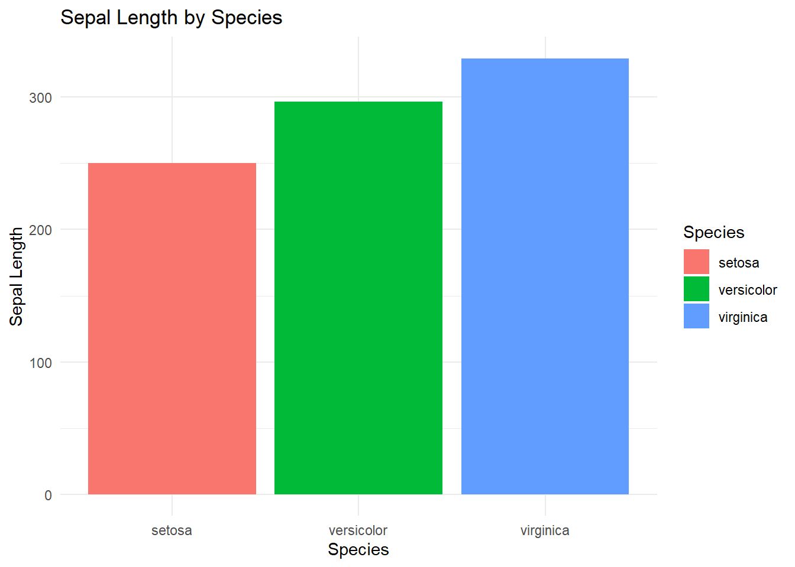
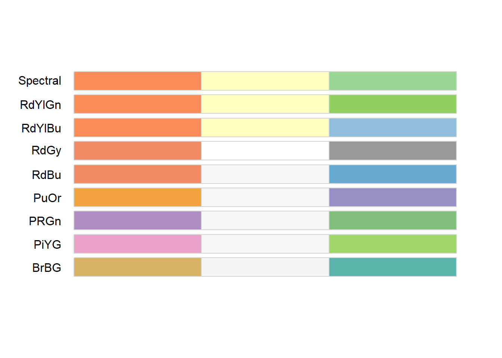
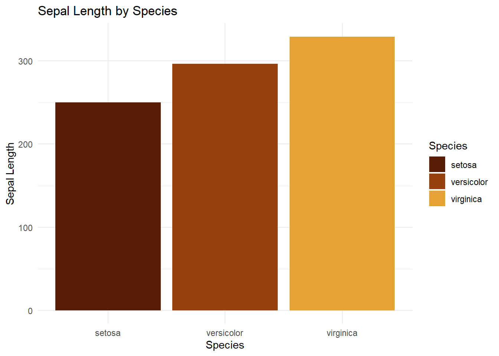

# R语言配色教程


> 第98期 R语言教程 科研绘图配色常用R包
>
> 在r语言，ggplot2绘图过程中最重要的一部分就是配色的选择。优秀的配色要充分考虑到颜色的区分度，期刊要求，冷暖特点等
>
> 本期介绍如何调整r语言中的配色，使整个图片美观优雅


## 基础工作

### 加载数据


``` r
library(bruceR)
```

```
## 
## bruceR (v2024.6)
## Broadly Useful Convenient and Efficient R functions
## 
## Packages also loaded:
## ✔ data.table	✔ emmeans
## ✔ dplyr     	✔ lmerTest
## ✔ tidyr     	✔ effectsize
## ✔ stringr   	✔ performance
## ✔ ggplot2   	✔ interactions
## 
## Main functions of `bruceR`:
## cc()          	Describe() 	TTEST()
## add()         	Freq()     	MANOVA()
## .mean()       	Corr()     	EMMEANS()
## set.wd()      	Alpha()    	PROCESS()
## import()      	EFA()      	model_summary()
## print_table() 	CFA()      	lavaan_summary()
## 
## For full functionality, please install all dependencies:
## install.packages("bruceR", dep=TRUE)
## 
## Online documentation:
## https://psychbruce.github.io/bruceR
## 
## To use this package in publications, please cite:
## Bao, H.-W.-S. (2024). bruceR: Broadly useful convenient and efficient R functions (Version 2024.6) [Computer software]. https://CRAN.R-project.org/package=bruceR
```

``` r
library(ggplot2)
data(iris)
head(iris, 10)
```

```
##    Sepal.Length Sepal.Width Petal.Length Petal.Width Species
## 1           5.1         3.5          1.4         0.2  setosa
## 2           4.9         3.0          1.4         0.2  setosa
## 3           4.7         3.2          1.3         0.2  setosa
## 4           4.6         3.1          1.5         0.2  setosa
## 5           5.0         3.6          1.4         0.2  setosa
## 6           5.4         3.9          1.7         0.4  setosa
## 7           4.6         3.4          1.4         0.3  setosa
## 8           5.0         3.4          1.5         0.2  setosa
## 9           4.4         2.9          1.4         0.2  setosa
## 10          4.9         3.1          1.5         0.1  setosa
```

### 使用r默认配色方案


``` r
ggplot(iris, aes(x = Species, y = Sepal.Length, fill = Species)) +
  geom_bar(stat = "identity") +
  labs(title = "Sepal Length by Species", x = "Species", y = "Sepal Length") +
  theme_minimal()
```



### ggplot2手动调色


``` r
ggplot(iris, aes(x = Species, y = Sepal.Length, fill = Species)) +
  geom_bar(stat = "identity") +
  labs(title = "Sepal Length by Species", x = "Species", y = "Sepal Length") +
  theme_minimal()+
  scale_fill_manual(values = c("black", "grey", "brown"))
```


## 使用RColorBrewer包设置颜色
### Rcolorbrew介绍

[CRAN库:CRAN: Package RColorBrewer (r-project.org)](https://cran.r-project.org/web/packages/RColorBrewer/)

调用网站https://colorbrewer2.org/上的配色方案,使用人数众多,整体比较中规中矩


``` r
library(RColorBrewer)
```


### 查看配色盘，选择3颜色，区分色


1. 先display配色,查看目标色数和色型
2. 选择合适的调色盘,在ggplot中使用 `scale_*_brewer`调用


``` r
display.brewer.all(3, type = 'div')
```




### ggplot2建立柱状图可视化

``` r
ggplot(iris, aes(x = Species, y = Sepal.Length, fill = Species)) +
  geom_bar(stat = "identity") +
  labs(title = "Sepal Length by Species", x = "Species", y = "Sepal Length") +
  theme_minimal()+
  scale_fill_brewer(palette = "Spectral")
```


## 使用ggsci包设置颜色


### R包介绍

ggsci包含期刊或软件的经典配色,投稿时调用快,效果好,顺手就用上了我用该包配色最多

CRAN库:[CRAN: Package ggsci (r-project.org)](https://cran.r-project.org/web/packages/ggsci/)

教程:[Scientific Journal and Sci-Fi Themed Color Palettes for ggplot2 (r-project.org)](https://cran.r-project.org/web/packages/ggsci/vignettes/ggsci.html)

``` r
library(ggsci)
```

### 配色方案

| Name            | Scales                                                   | Palette Types                                                                                                                                                                                                    | Palette Generator    |
| --------------- | -------------------------------------------------------- | ---------------------------------------------------------------------------------------------------------------------------------------------------------------------------------------------------------------- | -------------------- |
| NPG             | `scale_color_npg()` `scale_fill_npg()`                   | `"nrc"`                                                                                                                                                                                                          | `pal_npg()`          |
| AAAS            | `scale_color_aaas()` `scale_fill_aaas()`                 | `"default"`                                                                                                                                                                                                      | `pal_aaas()`         |
| NEJM            | `scale_color_nejm()` `scale_fill_nejm()`                 | `"default"`                                                                                                                                                                                                      | `pal_nejm()`         |
| Lancet          | `scale_color_lancet()` `scale_fill_lancet()`             | `"lanonc"`                                                                                                                                                                                                       | `pal_lancet()`       |
| JAMA            | `scale_color_jama()` `scale_fill_jama()`                 | `"default"`                                                                                                                                                                                                      | `pal_jama()`         |
| BMJ             | `scale_color_bmj()` `scale_fill_bmj()`                   | `"default"`                                                                                                                                                                                                      | `pal_bmj()`          |
| JCO             | `scale_color_jco()` `scale_fill_jco()`                   | `"default"`                                                                                                                                                                                                      | `pal_jco()`          |
| UCSCGB          | `scale_color_ucscgb()` `scale_fill_ucscgb()`             | `"default"`                                                                                                                                                                                                      | `pal_ucscgb()`       |
| D3              | `scale_color_d3()``scale_fill_d3()`                      | `"category10"` `"category20"` `"category20b"` `"category20c"`                                                                                                                                                    | `pal_d3()`           |
| Observable      | `scale_color_observable()` `scale_fill_observable()`     | `"observable10"`                                                                                                                                                                                                 | `pal_observable()`   |
| LocusZoom       | `scale_color_locuszoom()` `scale_fill_locuszoom()`       | `"default"`                                                                                                                                                                                                      | `pal_locuszoom()`    |
| IGV             | `scale_color_igv()` `scale_fill_igv()`                   | `"default"``"alternating"`                                                                                                                                                                                       | `pal_igv()`          |
| COSMIC          | `scale_color_cosmic()` `scale_fill_cosmic()`             | `"hallmarks_light"``"hallmarks_dark"``"signature_substitutions"`                                                                                                                                                 | `pal_cosmic()`       |
| UChicago        | `scale_color_uchicago()` `scale_fill_uchicago()`         | `"default"``"light"``"dark"`                                                                                                                                                                                     | `pal_uchicago()`     |
| Star Trek       | `scale_color_startrek()` `scale_fill_startrek()`         | `"uniform"`                                                                                                                                                                                                      | `pal_startrek()`     |
| Tron Legacy     | `scale_color_tron()` `scale_fill_tron()`                 | `"legacy"`                                                                                                                                                                                                       | `pal_tron()`         |
| Futurama        | `scale_color_futurama()` `scale_fill_futurama()`         | `"planetexpress"`                                                                                                                                                                                                | `pal_futurama()`     |
| Rick and Morty  | `scale_color_rickandmorty()` `scale_fill_rickandmorty()` | `"schwifty"`                                                                                                                                                                                                     | `pal_rickandmorty()` |
| The Simpsons    | `scale_color_simpsons()` `scale_fill_simpsons()`         | `"springfield"`                                                                                                                                                                                                  | `pal_simpsons()`     |
| Flat UI         | `scale_color_flatui()` `scale_fill_flatui()`             | `"default"` `"flattastic"` `"aussie"`                                                                                                                                                                            | `pal_flatui()`       |
| Frontiers       | `scale_color_frontiers()` `scale_fill_frontiers()`       | `"default"`                                                                                                                                                                                                      | `pal_frontiers()`    |
| GSEA            | `scale_color_gsea()` `scale_fill_gsea()`                 | `"default"`                                                                                                                                                                                                      | `pal_gsea()`         |
| Bootstrap 5     | `scale_color_bs5()` `scale_fill_bs5()`                   | `"blue"` `"indigo"``"purple"` `"pink"``"red"` `"orange"``"yellow"` `"green"``"teal"` `"cyan"``"gray"`                                                                                                            | `pal_bs5()`          |
| Material Design | `scale_color_material()` `scale_fill_material()`         | `"red"` `"pink"``"purple"` `"deep-purple"``"indigo"` `"blue"``"light-blue"` `"cyan"``"teal"` `"green"``"light-green"` `"lime"``"yellow"` `"amber"``"orange"` `"deep-orange"``"brown"` `"grey"``"blue-grey"`      | `pal_material()`     |
| Tailwind CSS    | `scale_color_tw3()` `scale_fill_tw3()`                   | `"slate"` `"gray"``"zinc"` `"neutral"``"stone"` `"red"``"orange"` `"amber"``"yellow"` `"lime"``"green"` `"emerald"``"teal"` `"cyan"``"sky"` `"blue"``"indigo"` `"violet"``"purple"` `"fuchsia"``"pink"` `"rose"` | `pal_tw3()`          |


### 柳叶刀配色


``` r
ggplot(iris, aes(x = Species, y = Sepal.Length, fill = Species)) +
  geom_bar(stat = "identity") +
  labs(title = "Sepal Length by Species", x = "Species", y = "Sepal Length") +
  theme_minimal()+
  scale_fill_lancet()
```


## 其它实用r包

### viridis: Colorblind-Friendly Color Maps for R

#### 介绍

官方仓库:[CRAN: Package viridis (r-project.org)](https://cran.r-project.org/web/packages/viridis/)

教程:[Introduction to the viridis color maps (r-project.org)](https://cran.r-project.org/web/packages/viridis/vignettes/intro-to-viridis.html)

多用于连续渐变色

#### 使用效果

色盘


使用方案参考


### 使用MetBrewer包设置颜色

#### r包介绍

官方CRAN库:[CRAN: Package MetBrewer (r-project.org)](https://cran.r-project.org/web/packages/MetBrewer/)

配色方案参考纽约大都会艺术博物馆,艺术感爆表一起来看看


``` r
library(MetBrewer)
```


#### 查看配色盘，选择3颜色，区分色

``` r
ggplot(iris, aes(x = Species, y = Sepal.Length, fill = Species)) +
  geom_bar(stat = "identity") +
  labs(title = "Sepal Length by Species", x = "Species", y = "Sepal Length") +
  theme_minimal()+
  scale_fill_manual(values = met.brewer("Austria"))
```


``` r
ggplot(iris, aes(x = Species, y = Sepal.Length, fill = Species)) +
  geom_bar(stat = "identity") +
  labs(title = "Sepal Length by Species", x = "Species", y = "Sepal Length") +
  theme_minimal()+
  scale_fill_manual(values = met.brewer("Degas"))
```



最后看看好看


