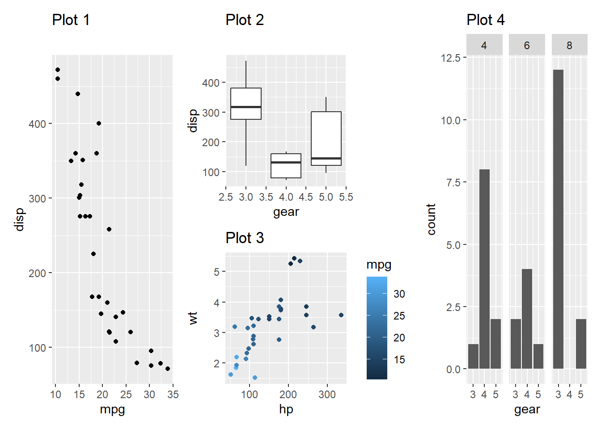
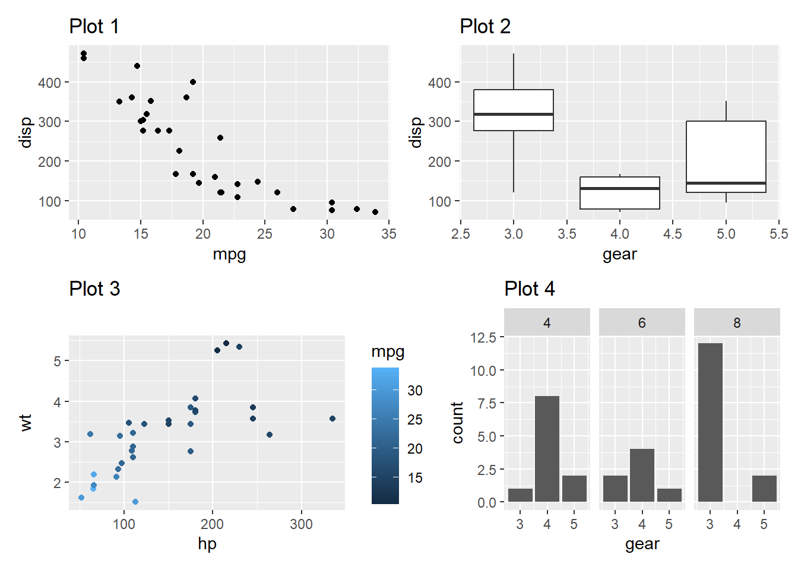
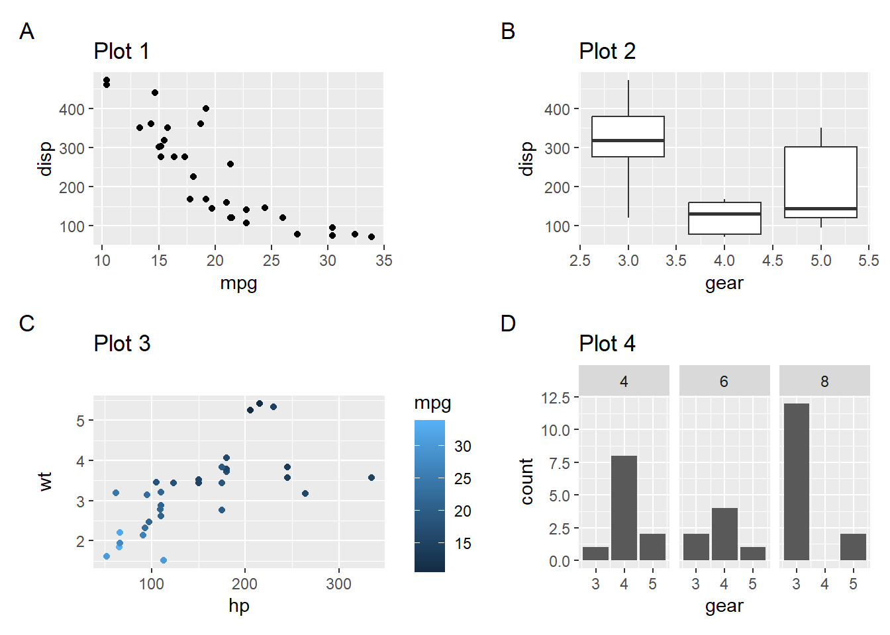
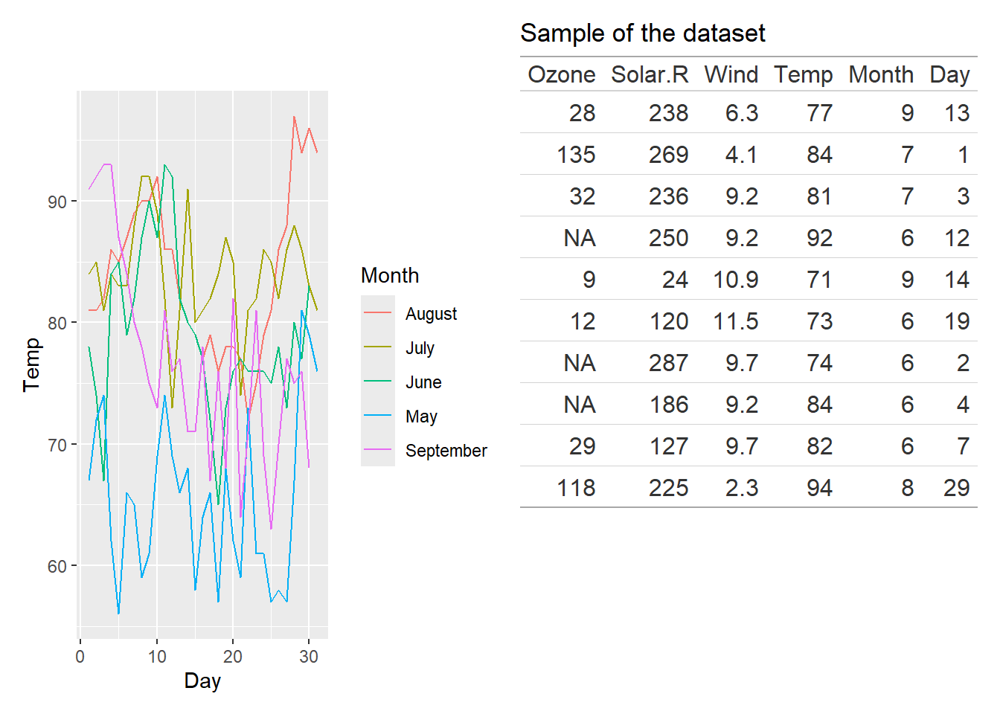
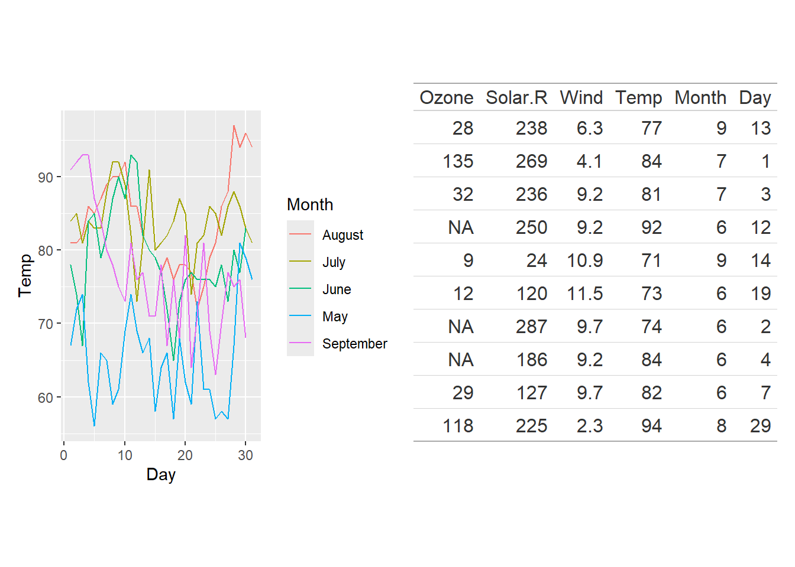

# R可视化教程-patchwork：拒绝ps，R内实现多图拼接


## R包介绍
Patchwork 是一个软件包，旨在使 R 中的绘图合成变得极其简单和强大。它主要面向 ggplot2 的用户，无论绘图的复杂程度如何，它都能不遗余力地确保 ggplots 正确对齐。

注意：仅用于ggplot2的绘图，R的base绘图不能用patchwork拼接

链接:[CRAN链接](https://cran.r-project.org/web/packages/patchwork/index.html)

学习手册:[学习手册](https://cran.r-project.org/web/packages/patchwork/vignettes/patchwork.html)

## R包安装


``` r
install.packages("patchwork")
```


## R包使用

### 先生成多图准备着


``` r
library(ggplot2)
library(patchwork)

p1 <- ggplot(mtcars) + 
  geom_point(aes(mpg, disp)) + 
  ggtitle('Plot 1')

p2 <- ggplot(mtcars) + 
  geom_boxplot(aes(gear, disp, group = gear)) + 
  ggtitle('Plot 2')

p3 <- ggplot(mtcars) + 
  geom_point(aes(hp, wt, colour = mpg)) + 
  ggtitle('Plot 3')

p4 <- ggplot(mtcars) + 
  geom_bar(aes(gear)) + 
  facet_wrap(~cyl) + 
  ggtitle('Plot 4')
```

### 基础用法

patchwork的基础用法就是使用数学符号(`+`和`/`)来实现图形的横纵拼接

### 多图横拼接


``` r
p1 + p2
```


默认patchwork会让图形呈方形排列，即nxn


``` r
p1 + p2 + p3 + p4
```


### 多图纵拼接


``` r
p1/p2
```


### 复合图拼接

这里图形拼接类似于数学符号的表达式，同样遵循先乘除后加减的规律,有括号先括号


``` r
p1 + p2 / p3 + p4
```



``` r
(p1 + p2)/(p3 + p4 )
```



## 添加图注

patchwork提供了`plot_annotation`函数来实现图注的添加

### 小图的图注

自定义tag_levels参数，可能的值有：“a ”表示小写字母，“A ”表示大写字母，“1 ”表示数字，“i ”表示小写罗马数字，“I ”表示大写罗马数字。它也可以是一个包含定义任意标记序列的字符向量的列表

``` r
p1 + p2 + p3 + p4 + plot_annotation(tag_levels = 'A')
```




### 拼图整体图注


``` r
(p1 | (p2 / p3)) + 
  plot_annotation(title = 'The surprising story about mtcars')
```


## 图表拼接

### 基本操作
patchwork还支持将表格和图表拼接起来，需要注意的是，表格和图表的拼接需要使用`gt`包

``` r
#install.packages("gt")
library(gt)
library(ggplot2)
library(patchwork)

p1 <- ggplot(airquality) +
  geom_line(aes(x = Day, y = Temp, colour = month.name[Month])) +
  labs(colour = "Month")

aq <- airquality[sample(nrow(airquality), 10), ]
p1 + gt(aq) + ggtitle("Sample of the dataset")
```


### 参数调整

wrap_table() 可以控制其中的一些行为。首先，我们可以减小表格中的字体大小，使其变小，但也可以为其留出更多空间。我们可以使用 plot_layout(widths = ...)来做到这一点，但这需要我们进行大量的猜测才能做到恰到好处。值得庆幸的是，patchwork 足够聪明，可以帮我们解决这个问题，我们可以使用 wrap_table() 中的 space 参数指示它这样做。将空间参数设置为 “free_y ”后，patchwork 就会将宽度固定为表格宽度，但保持高度自由：


``` r
p1 + wrap_table(gt(aq), space = "free_y") + ggtitle("Sample of the dataset")
```



``` r
p1 + wrap_table(aq, space = "fixed")
```



如果空间固定在 Y 方向，而表格中有任何来源注释或脚注，则这些注释或脚注会像列头一样，根据面板设置放置在面板区域之外。


``` r
aq_footer <- gt(aq) |>
  tab_source_note("This is not part of the table body")
p1 + wrap_table(aq_footer, space = "fixed")
```


### 其它

图表拼接是patchwork的最新功能，详细的教程参见[链接](https://www.tidyverse.org/blog/2024/09/patchwork-1-3-0/)
