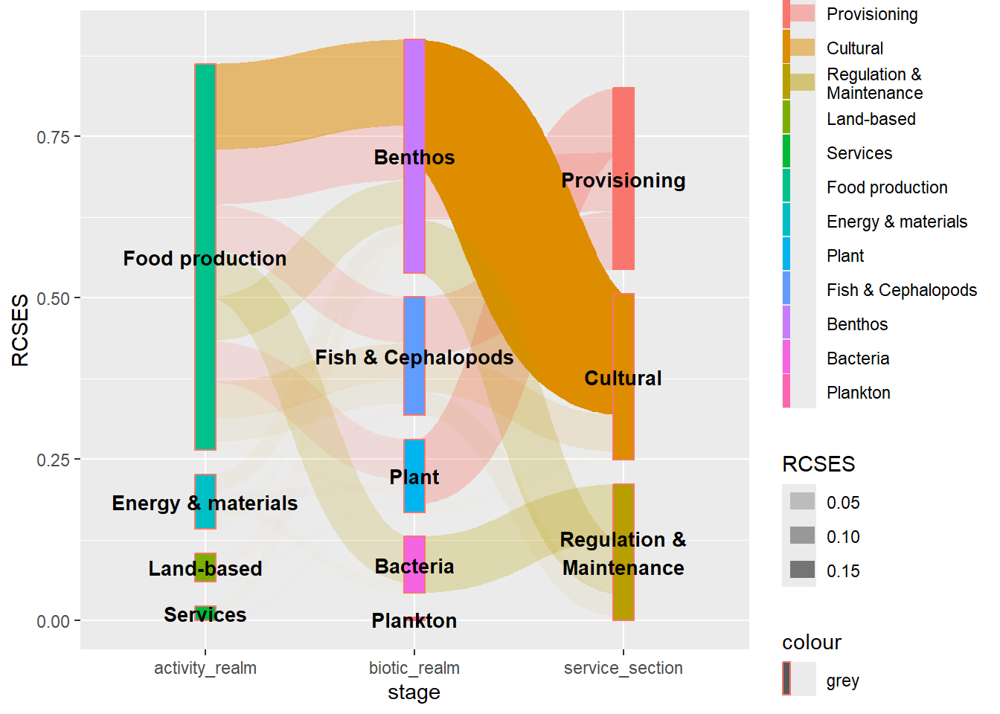

# R语言桑基图绘制


> 本期主要介绍常用桑基图（流量图）绘制包和相关代码教程
> 
> 桑基图也叫流量图，主要用来处理多个分类变量的分布情况。可视化展示占比比例等，美观容易

## R包介绍

[CRAN库](https://cran.r-project.org/web/packages/ggsankeyfier/index.html)

[教程手册](https://cran.r-project.org/web/packages/ggsankeyfier/vignettes/decorating.html)

## R包安装


``` r
install.packages("ggsankeyfier")
```

## R包使用

桑基图本质上就是不同分类变量的流量图，可视化的第一步就是数据整洁化，常用数据宽变长。一列是变量，一列是流量值，在`ggsankeyfier`使用过程中重要的就是用`pivot_stages_longer`来做数据清洗

### 数据准备


``` r
library(ggsankeyfier)
library(tidyverse)
library(cowplot)
```

``` r

## first get a data set with a wide format:
data(ecosystem_services)
data <- ecosystem_services

## pivot to long format for plotting:
data_neat <-
  data |>
  subset(RCSES > 0.005) |>
  pivot_stages_longer(
    c("activity_realm", "biotic_realm", "service_section"),
    "RCSES", "service_section"
  )

# pivot宽变长前
head(data, 5)
## # A tibble: 5 × 8
##   activity_type          activity_realm pressure_cat   biotic_group biotic_realm
##   <chr>                  <chr>          <chr>          <chr>        <chr>       
## 1 Agriculture & Forestry Land-based     Biological di… Zooplankton  Plankton    
## 2 Agriculture & Forestry Land-based     Biological di… Zooplankton  Plankton    
## 3 Agriculture & Forestry Land-based     Chemical chan… Zooplankton  Plankton    
## 4 Agriculture & Forestry Land-based     Chemical chan… Zooplankton  Plankton    
## 5 Agriculture & Forestry Land-based     Physical chan… Zooplankton  Plankton    
## # ℹ 3 more variables: service_division <chr>, service_section <chr>,
## #   RCSES <dbl>
```

``` r
# 宽变长后
head(data_neat, 5)
## # A tibble: 5 × 6
##   service_section  RCSES edge_id connector node               stage         
##   <fct>            <dbl>   <int> <chr>     <fct>              <fct>         
## 1 Provisioning    0.0123       1 from      Land-based         activity_realm
## 2 Provisioning    0.0123       1 to        Plant              biotic_realm  
## 3 Provisioning    0.0133       2 from      Land-based         activity_realm
## 4 Provisioning    0.0133       2 to        Fish & Cephalopods biotic_realm  
## 5 Cultural        0.0127       3 from      Land-based         activity_realm
```

## 总绘图绘图代码


``` r
data_neat |>
  ggplot(
    mapping = aes(
      x = stage, y = RCSES,
      group = node, edge_id = edge_id, connector = connector
    )
  ) +
  geom_sankeyedge(aes(alpha = RCSES, fill = service_section),
    position = position_sankey(
      order = "ascending", v_space = "auto",
      width = 0.01
    )
  ) +
  geom_sankeynode(aes(fill = node, color = "grey"),
    position = position_sankey(
      order = "ascending", v_space = "auto",
      width = 0.11
    ),
    show.legend = FALSE
  ) +
  geom_text(
    data = data_neat,
    aes(label = node), stat = "sankeynode",
    position = position_sankey(v_space = "auto", order = "ascending", nudge_x = 0),
    hjust = 0.5, size = 3.5, fontface = "bold", color = "black"
  )+
  guides(
    alpha = FALSE,
    colour = FALSE,
    fill = guide_legend(position = "bottom", nrow = 1)
  ) +
  scale_fill_discrete(
    breaks = unique(data_neat$service_section)[1:3]  # 只在图例中显示前三个键
  )+
  theme_minimal_hgrid() +
  theme( # 去除周围外边距
    panel.spacing = unit(0, "cm"),
    panel.grid.major.y = element_blank(),
    axis.text.y = element_blank(),
    axis.title = element_blank(),
    legend.key.spacing.x = unit(60, "pt")
  ) 
```

```
## Warning: The `<scale>` argument of `guides()` cannot be `FALSE`. Use "none" instead as
## of ggplot2 3.3.4.
## This warning is displayed once every 8 hours.
## Call `lifecycle::last_lifecycle_warnings()` to see where this warning was
## generated.
```


## 绘图代码拆解

接下来我们拆解上边一大段代码，一步步的跑出来就会感觉好很多啦。数据的预先准备至关重要，这个就不讲了

### 第一步我们先把sankeyedge做出来，就是中间的流量

看到我们设置了一个至关重要的的参数position：这个参数决定了sankeyedge的位置，我们设置为`position_sankey(order ="ascending",v_space="auto",width = 0.01)`，其中order是设置sankeyedge的方向，ascending是从左到右，descending是从右到左，v_space是设置sankeyedge的间距，auto是自动设置，width是设置sankeyedge的宽度。


``` r
############# 修改填充颜色美观
data_neat |>
  ggplot(
    mapping = aes(
      x = stage, y = RCSES,
      group = node, edge_id = edge_id, connector = connector, fill = stage
    )
  ) +
  geom_sankeyedge(aes(alpha = RCSES, fill = service_section),
    position = position_sankey(
      order = "ascending", v_space = "auto",
      width = 0.01
    )
  )
```


### 很好，下一部我们把node给加上，就是各个小方块

设置node的填充色是node，然后边框设置成灰色


``` r
data_neat |>
  ggplot(
    mapping = aes(
      x = stage, y = RCSES,
      group = node, edge_id = edge_id, connector = connector
    )
  ) +
  geom_sankeyedge(aes(alpha = RCSES, fill = service_section),
    position = position_sankey(
      order = "ascending", v_space = "auto",
      width = 0.01
    )
  ) +
  geom_sankeynode(aes(fill = node, color = "grey"),
    position = position_sankey(
      order = "ascending", v_space = "auto",
      width = 0.1
    )
  )
```


### 然后我们添加文字到图形里

注意添加 `stat = "sankeynode"`


``` r
data_neat |>
  ggplot(
    mapping = aes(
      x = stage, y = RCSES,
      group = node, edge_id = edge_id, connector = connector
    )
  ) +
  geom_sankeyedge(aes(alpha = RCSES, fill = service_section),
    position = position_sankey(
      order = "ascending", v_space = "auto",
      width = 0.01
    )
  ) +
  geom_sankeynode(aes(fill = node, color = "grey"),
    position = position_sankey(
      order = "ascending", v_space = "auto",
      width = 0.1
    )
  ) +
  geom_text(
    data = data_neat,
    aes(label = node), stat = "sankeynode",
    position = position_sankey(v_space = "auto", order = "ascending", nudge_x = 0),
    hjust = 0.5, size = 3.5, fontface = "bold", color = "black"
  )
```



### 最后阶段我们修改一下图例，改改主题

我们的主要变量是service_section（geom_sankeyedge的fill映射），我们在这里就设置这个作为图例，其它都删掉。这一部分说起来简单，其实挺麻烦的。


``` r
data_neat |>
  ggplot(
    mapping = aes(
      x = stage, y = RCSES,
      group = node, edge_id = edge_id, connector = connector
    )
  ) +
  geom_sankeyedge(aes(alpha = RCSES, fill = service_section),
    position = position_sankey(
      order = "ascending", v_space = "auto",
      width = 0.01
    )
  ) +
  geom_sankeynode(aes(fill = node, color = "grey"),
    position = position_sankey(
      order = "ascending", v_space = "auto",
      width = 0.11
    ),
    show.legend = FALSE
  ) +
  geom_text(
    data = data_neat,
    aes(label = node), stat = "sankeynode",
    position = position_sankey(v_space = "auto", order = "ascending", nudge_x = 0),
    hjust = 0.5, size = 3.5, fontface = "bold", color = "black"
  )+
  guides(
    alpha = FALSE,
    colour = FALSE,
    fill = guide_legend(position = "bottom", nrow = 1)
  ) +
  scale_fill_discrete(
    breaks = unique(data_neat$service_section)[1:3]  # 只在图例中显示前三个键
  )+
  theme_minimal_hgrid() +
  theme( # 去除周围外边距
    panel.spacing = unit(0, "cm"),
    panel.grid.major.y = element_blank(),
    axis.text.y = element_blank(),
    axis.title = element_blank(),
    legend.key.spacing.x = unit(60, "pt")
  ) 
```


