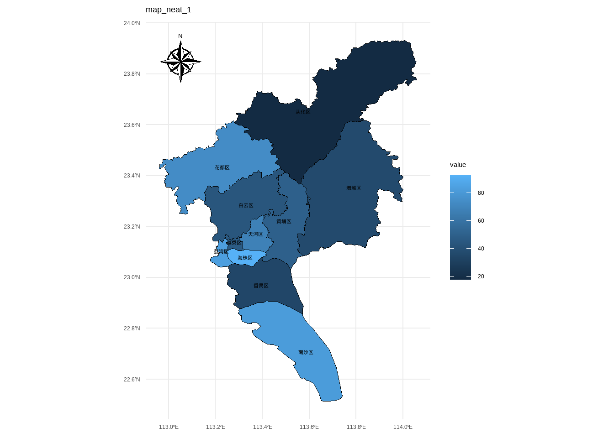
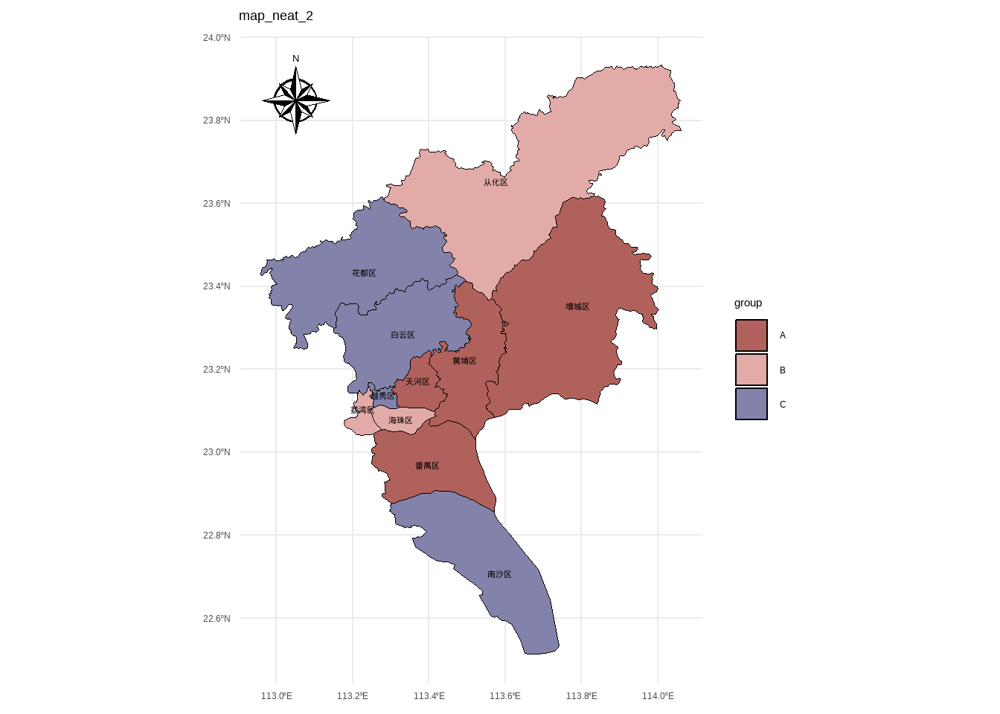

# R语言采样地图绘制详细教程


> 本期主要介绍如何绘制采样地图和国内区域地图，并自定义相关内容

## R包介绍

[ggspatial教程](https://cran.r-project.org/web/packages/ggspatial/index.html)

## R包安装


``` r
install.packages("ggspatial")
install.packages("sf")
```

## 基础绘图代码

### 导入地图json数据

进入从[阿里云DataV可视化网站](http://datav.aliyun.com/portal/school/atlas/area_selector)（可选择其他平台）下载格式为.json的地图数据：


### 数据导入


``` r
library(ggspatial)
library(sf)
```

```
## Linking to GEOS 3.11.2, GDAL 3.8.2, PROJ 9.3.1; sf_use_s2() is TRUE
```

``` r
library(ggplot2)

# 导入地图json数据
map <- st_read("01-attch\\10\\广州市.json")
```

```
## Reading layer `广州市' from data source 
##   `D:\0 zotero笔记\06-其它\3 公众号\1 blogpost-r\01-attch\10\广州市.json' 
##   using driver `GeoJSON'
## Simple feature collection with 11 features and 9 fields
## Geometry type: MULTIPOLYGON
## Dimension:     XY
## Bounding box:  xmin: 112.9585 ymin: 22.51436 xmax: 114.06 ymax: 23.93292
## Geodetic CRS:  WGS 84
```

### 开始绘制

#### 添加省份区边框

``` r
ggplot() +
  labs(title = "Guangzhou", x = NULL, y = NULL) +
  geom_sf(data = map, fill = c("#f0eedf"), size = 0.8, color = "black")
```


#### 添加指南针annotation


``` r
p <- ggplot() +
  labs(title = "Guangzhou", x = NULL, y = NULL) +
  geom_sf(data = map, fill = c("#f0eedf"), size = 0.8, color = "black") + # 设置比例尺
  annotation_north_arrow(
    location = "tl",
    style = north_arrow_nautical(
      fill = c("black", "white"),
      line_col = "black"
    )
  )
p
```


## 我们来自定义绘图内容

### 设置白云区天河区突出显示

我们新加一个图层就可以，然后fill填充亮色


``` r
p + geom_sf(
  data = map |> dplyr::filter(name %in% c("天河区", "白云区", "番禺区")),
  fill = c("#c98c50"),
  size = 0.8,
  color = "black"
)
```


### 设置text

接下来我们要在图里标注部分区名


``` r
library(showtext)
showtext::showtext_auto()
```


``` r
p + geom_sf(
  data = map |> dplyr::filter(name %in% c("天河区", "白云区", "番禺区")),
  fill = c("#c98c50"),
  size = 0.8,
  color = "black"
) +
  geom_sf_text(
    data = map |> dplyr::filter(name %in% c("天河区", "白云区", "番禺区")),
    aes(label = name),
    size = 3,
    color = "black",
    fontface = "bold"
  )
```


### 设置一个合适的主题


``` r
p2 <-
  p + geom_sf(
    data = map |> dplyr::filter(name %in% c("天河区", "白云区", "番禺区")),
    fill = c("#c98c50"),
    size = 0.8,
    color = "black"
  ) +
  geom_sf_text(
    data = map |> dplyr::filter(name %in% c("天河区", "白云区", "番禺区")),
    aes(label = name),
    size = 3,
    color = "black",
    fontface = "bold"
  ) +
  theme_minimal()

p2
```


### 设置根据数值变量对各区的fill进行映射


``` r
# 先生成一个随机变量
map_neat_1 <-
  map |>
  dplyr::mutate(
    value = sample(1:100, nrow(map), replace = TRUE)
  )


ggplot() +
  labs(title = "map_neat_1", x = NULL, y = NULL) +
  geom_sf(data = map_neat_1, aes(fill = value), size = 0.8, color = "black") + # 设置比例尺
  annotation_north_arrow(
    location = "tl",
    style = north_arrow_nautical(
      fill = c("black", "white"),
      line_col = "black"
    )
  ) +
  geom_sf_text(
    data = map,
    aes(label = name),
    size = 3,
    color = "black",
    fontface = "bold"
  ) +
  theme_minimal()
```



### 根据分类变量对区进行fill映射


``` r
library(MetBrewer)

map_neat_2 <-
  map |>
  dplyr::mutate(
    group = sample(c("A", "B", "C"), nrow(map), replace = TRUE)
  )

ggplot() +
  labs(title = "map_neat_2", x = NULL, y = NULL) +
  geom_sf(data = map_neat_2, aes(fill = group), size = 0.8, color = "black") + # 设置比例尺
  annotation_north_arrow(
    location = "tl",
    style = north_arrow_nautical(
      fill = c("black", "white"),
      line_col = "black"
    )
  ) +
  geom_sf_text(
    data = map,
    aes(label = name),
    size = 3,
    color = "black",
    fontface = "bold"
  ) +
  theme_minimal() +
  scale_fill_met_d("Cassatt1")
```



### 添加采样点


``` r
data_sample <-
  tibble::tibble(
    lon = c(113.292333, 113.412333, 113.532333),
    lat = c(23.191944, 23.331944, 22.931944),
    point = c("A", "B", "C"),
  )

p2 +
  geom_point(
    data = data_sample,
    aes(x = lon, y = lat),
    size = 2,
    color = "#1647a3"
  ) +
  geom_text(
    data = data_sample,
    aes(x = lon, y = lat, label = point),
    size = 4,
    color = "#000000",
    fontface = "bold",
    nudge_y = 0.05
  )+
  labs(title = "广州市")+
  theme(plot.title = element_text(hjust = 0.5))
```


