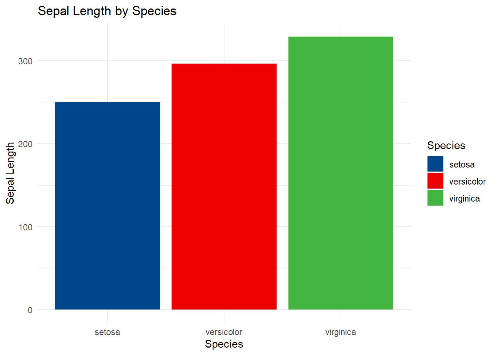

# R语言配色教程


``` r
library(bruceR)
```

```
## 
## bruceR (v2024.6)
## Broadly Useful Convenient and Efficient R functions
## 
## Packages also loaded:
## ✔ data.table	✔ emmeans
## ✔ dplyr     	✔ lmerTest
## ✔ tidyr     	✔ effectsize
## ✔ stringr   	✔ performance
## ✔ ggplot2   	✔ interactions
## 
## Main functions of `bruceR`:
## cc()          	Describe() 	TTEST()
## add()         	Freq()     	MANOVA()
## .mean()       	Corr()     	EMMEANS()
## set.wd()      	Alpha()    	PROCESS()
## import()      	EFA()      	model_summary()
## print_table() 	CFA()      	lavaan_summary()
## 
## For full functionality, please install all dependencies:
## install.packages("bruceR", dep=TRUE)
## 
## Online documentation:
## https://psychbruce.github.io/bruceR
## 
## To use this package in publications, please cite:
## Bao, H.-W.-S. (2024). bruceR: Broadly useful convenient and efficient R functions (Version 2024.6) [Computer software]. https://CRAN.R-project.org/package=bruceR
```

```
## 
## These packages are dependencies of `bruceR` but not installed:
## - pacman, ggtext, see, vars, phia, BayesFactor, GPArotation
## 
## ***** Install all dependencies *****
## install.packages("bruceR", dep=TRUE)
```

``` r
library(ggplot2)
data(iris)
head(iris, 10)
```

```
##    Sepal.Length Sepal.Width Petal.Length Petal.Width Species
## 1           5.1         3.5          1.4         0.2  setosa
## 2           4.9         3.0          1.4         0.2  setosa
## 3           4.7         3.2          1.3         0.2  setosa
## 4           4.6         3.1          1.5         0.2  setosa
## 5           5.0         3.6          1.4         0.2  setosa
## 6           5.4         3.9          1.7         0.4  setosa
## 7           4.6         3.4          1.4         0.3  setosa
## 8           5.0         3.4          1.5         0.2  setosa
## 9           4.4         2.9          1.4         0.2  setosa
## 10          4.9         3.1          1.5         0.1  setosa
```

## 使用RColorBrewer包设置颜色

``` r
library(RColorBrewer)
```


### 查看配色盘，选择3颜色，区分色

``` r
display.brewer.all(3, type = 'div')
```


### ggplot2建立柱状图可视化

``` r
ggplot(iris, aes(x = Species, y = Sepal.Length, fill = Species)) +
  geom_bar(stat = "identity") +
  labs(title = "Sepal Length by Species", x = "Species", y = "Sepal Length") +
  theme_minimal()+
  scale_fill_brewer(palette = "Spectral")
```


## 使用ggsci包设置颜色

``` r
library(ggsci)
```


### 柳叶刀配色


``` r
ggplot(iris, aes(x = Species, y = Sepal.Length, fill = Species)) +
  geom_bar(stat = "identity") +
  labs(title = "Sepal Length by Species", x = "Species", y = "Sepal Length") +
  theme_minimal()+
  scale_fill_lancet()
```


## 使用MetBrewer包设置颜色


``` r
library(MetBrewer)
```


## 查看配色盘，选择3颜色，区分色

``` r
ggplot(iris, aes(x = Species, y = Sepal.Length, fill = Species)) +
  geom_bar(stat = "identity") +
  labs(title = "Sepal Length by Species", x = "Species", y = "Sepal Length") +
  theme_minimal()+
  scale_fill_manual(values = met.brewer("Austria"))
```




``` r
ggplot(iris, aes(x = Species, y = Sepal.Length, fill = Species)) +
  geom_bar(stat = "identity") +
  labs(title = "Sepal Length by Species", x = "Species", y = "Sepal Length") +
  theme_minimal()+
  scale_fill_manual(values = met.brewer("Degas"))
```


